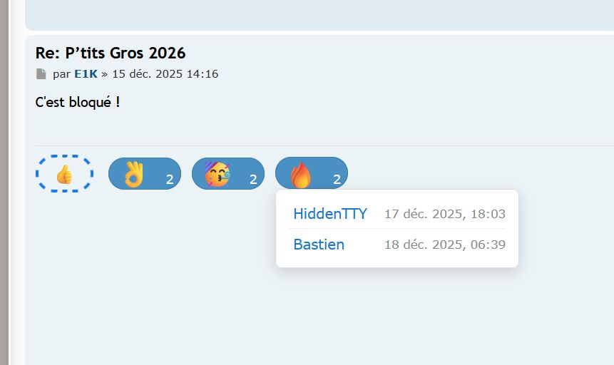
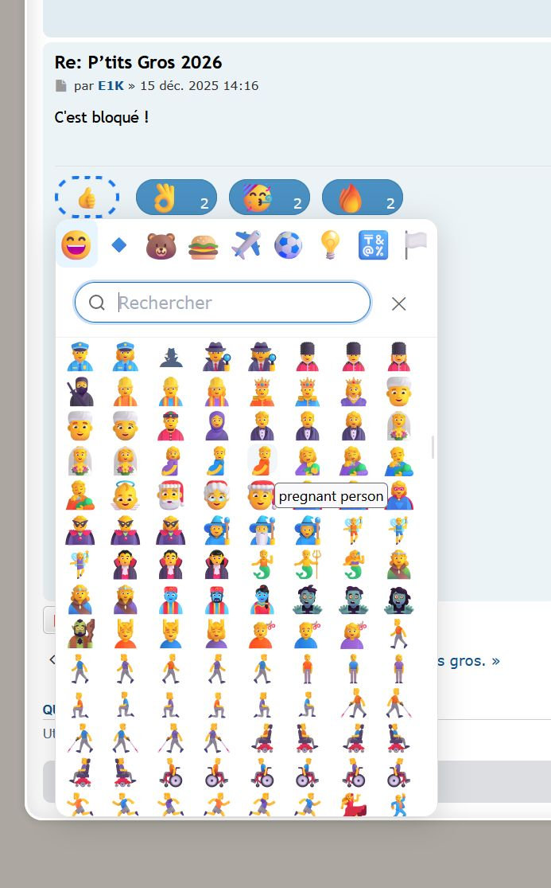

# 🚀 phpBB Reactions — Extension d'Émojis Ultra-Complète pour phpBB 3.3+

Ajoutez une dimension sociale et moderne à votre forum phpBB : laissez vos membres réagir à chaque message avec l'intégralité des émojis Unicode !  
**Expérience fluide, notifications intelligentes, personnalisation avancée, et performance garantie.**

---

## ✨ Fonctionnalités phares

- **Réactions illimitées** : Support complet de tous les émojis Unicode (👍 ❤️ 😂 👎 …), y compris les emojis composés et les dernières nouveautés.
- **Palette intelligente** : 10 emojis courants en accès rapide, palette étendue pour tous les autres.
- **Multi-réactions** : Jusqu'à 10 réactions différentes par utilisateur et par post (paramétrable).
- **Compteurs dynamiques** : Affichage en temps réel du nombre de réactions par emoji sous chaque message.
- **Tooltips interactifs** : Survolez un emoji pour voir qui a réagi.
- **AJAX ultra-rapide** : Toutes les interactions (ajout, retrait, affichage) sont instantanées, sans rechargement de page.
- **Notifications puissantes** :
   - **Synchronisation Intelligente** : Les réactions sont mises à jour sur la page sans action de l'utilisateur (ex: via `sync`).
  - **Cloche** : Notification immédiate dans le forum.
  - **Résumé e-mail** : Digest périodique groupé, anti-spam, personnalisable par l'utilisateur.
- **Préférences utilisateur** : Chaque membre choisit s'il veut recevoir des notifications (cloche, e-mail, ou aucune).
- **Limites configurables** : Nombre max de réactions par post, par utilisateur, délai anti-spam… tout est ajustable dans l'ACP.
- **Sécurité avancée** : Protection CSRF, validation stricte des emojis, contrôle des permissions, anti-spam natif.
- **Support multilingue** : Français et anglais inclus, facilement extensible.
- **Design responsive** : Parfaitement intégré à prosilver, compatible mobile/tablette.
- **Outils de Diagnostic** : Scripts de maintenance et de diagnostic inclus pour un débogage rapide et efficace.

---

## 🖼️ Aperçu




---

## 🛠️ Installation rapide

1. **Pré-requis** : phpBB 3.3.10+ (UTF8MB4 activé sur la base de données)
2. **Téléchargement** : [Dernière version sur GitHub](https://github.com/bastien59960/reactions)
3. **Déploiement** :
   - Dézippez dans `ext/bastien59960/reactions/`
   - Activez l'extension dans l'ACP > Personnalisation > Gérer les extensions
4. **Configuration** :
   - Rendez-vous dans l'ACP > Extensions > Post Reactions pour ajuster les paramètres (limites, activation, etc.)
   - Les utilisateurs peuvent gérer leurs préférences dans leur panneau utilisateur

---

## 📝 Fonctionnalités détaillées

### Réactions & interface
- Palette d'emojis rapide et palette complète
- Affichage des réactions sous chaque post
- Tooltips avec la liste des utilisateurs ayant réagi
- Ajout/retrait de réaction en un clic (AJAX)

### Notifications
- **Cloche** : Notification immédiate à l'auteur du message (hors auto-réaction)
- **Résumé e-mail** : Digest groupé, anti-spam (délai configurable, par défaut 45 min)
- Préférences individuelles (activer/désactiver chaque type)

### Configuration & personnalisation
- Limites par post et par utilisateur (modifiables dans l'ACP)
- Activation/désactivation globale de l'extension
- Délai anti-spam pour les notifications e-mail
- Support complet des emojis Unicode (utf8mb4 requis)

### Sécurité & robustesse
- Validation CSRF sur toutes les requêtes
- Validation stricte des emojis (longueur, unicité, caractères)
- Permissions phpBB respectées (seuls les membres autorisés peuvent réagir)
- Nettoyage automatique des notifications orphelines

### Performance
- Index SQL optimisés
- Requêtes AJAX groupées
- Cache des emojis
- Logs détaillés pour le debug

---

## 👨‍💻 Pour les Développeurs

Cette extension inclut des outils de diagnostic et de maintenance conçus pour accélérer le développement et le débogage.

### Script de Maintenance (`forum-purge.sh`)

Un script shell "tout-en-un" qui automatise un cycle complet de réinitialisation de l'extension. Idéal pour garantir un environnement de test propre.

**Fonctionnalités du script :**
- Sauvegarde et restauration automatiques des réactions.
- Désactivation, purge complète et réactivation de l'extension.
- Nettoyage du cache phpBB et des migrations corrompues.
- Test final de l'exécution du cron avec un rapport détaillé.

**Usage :**
```bash
# Placez-vous dans le répertoire de l'extension
cd /path/to/your/forum/ext/bastien59960/reactions/

# Exécutez le script
bash forum-purge.sh
```

---

## 📦 Structure du projet

```
reactions/
├── ext.php
├── config/           # Services, paramètres, routes
├── controller/       # Contrôleurs AJAX, UCP, etc.
├── event/            # Listener d'événements phpBB
├── notification/     # Types de notifications personnalisés
├── cron/             # Tâche cron pour les digests e-mail
├── migrations/       # Migrations de base de données
├── language/         # Fichiers de langue (fr, en)
├── styles/           # Templates, JS, CSS
└── ...
```

---

## 🔒 Sécurité & bonnes pratiques

- Validation CSRF et permissions à chaque étape
- Limites anti-spam configurables
- Logs d'erreur et de performance
- Nettoyage automatique des données orphelines

---

## 🚦 Roadmap & évolutions prévues

- Réactions personnalisées (emojis propres au forum)
- Statistiques avancées (tableaux de bord, top réactions)
- Intégration mobile et PWA
- API REST pour applications tierces
- Notifications en temps réel (WebSockets)
- Import/export des réactions
- Tests automatisés

---

## 🤝 Contribution & support

- **Bugs, suggestions, contributions** : ouvrez une issue ou une pull request sur GitHub
- **Documentation complète** : voir le dossier `/docs` et les fichiers `DOCUMENTATION.md`, `CONFIGURATION.md`
- **Communauté** : [Forum de support](https://bastien.debucquoi.com/forum/)

---

## 📄 Licence

GNU General Public License v2.0  
(c) 2025 Bastien59960

---

*Rejoignez la communauté, testez, contribuez, et faites de votre forum un espace vivant et interactif !*

---

# 🚀 phpBB Reactions — The Ultimate Emoji Extension for phpBB 3.3+ (English)

Bring your phpBB forum to life: let your members react to every post with the full range of Unicode emojis!  
**Smooth experience, smart notifications, advanced customization, and top performance.**

---

## ✨ Key Features

- **Unlimited reactions**: Full support for all Unicode emojis (👍 ❤️ 😂 👎 …), including composed and latest emojis.
- **Smart palette**: 10 quick-access emojis, full palette for all others.
- **Multi-reactions**: Up to 10 different reactions per user and per post (configurable).
- **Live counters**: Real-time display of reaction counts per emoji under each post.
- **Interactive tooltips**: Hover an emoji to see who reacted.
- **Ultra-fast AJAX**: All interactions (add, remove, display) are instant, no page reload.
- **Powerful notifications**:
  - **Smart Sync**: Reactions are updated on the page without user action (e.g., via `sync`).
  - **Bell**: Instant in-forum notification.
  - **Email digest**: Periodic grouped digest, anti-spam, user-customizable.
- **User preferences**: Each member chooses which notifications to receive (bell, email, or none).
- **Configurable limits**: Max reactions per post, per user, anti-spam delay… all adjustable in the ACP.
- **Advanced security**: CSRF protection, strict emoji validation, permission checks, built-in anti-spam.
- **Multilingual**: French and English included, easily extensible.
- **Responsive design**: Perfectly integrated with prosilver, mobile/tablet ready.
- **Diagnostic Tools**: Includes maintenance and diagnostic scripts for fast and efficient debugging.

---

## 🖼️ Preview


---

## 🛠️ Quick Installation

1. **Requirements**: phpBB 3.3.10+ (UTF8MB4 enabled on the database)
2. **Download**: [Latest version on GitHub](https://github.com/bastien59960/reactions)
3. **Deployment**:
   - Unzip into `ext/bastien59960/reactions/`
   - Enable the extension in ACP > Customise > Manage extensions
4. **Configuration**:
   - Go to ACP > Extensions > Post Reactions to adjust settings (limits, activation, etc.)
   - Users can manage their preferences in their user control panel

---

## 📝 Detailed Features

### Reactions & Interface
- Quick and full emoji palette
- Display of reactions under each post
- Tooltips with the list of users who reacted
- Add/remove reaction in one click (AJAX)

### Notifications
- **Bell**: Instant notification to the post author (except self-reaction)
- **Email digest**: Grouped digest, anti-spam (configurable delay, default 45 min)
- Individual preferences (enable/disable each type)

### Configuration & Customization
- Limits per post and per user (modifiable in ACP)
- Global enable/disable of the extension
- Anti-spam delay for email notifications
- Full Unicode emoji support (utf8mb4 required)

### Security & Robustness
- CSRF validation on all requests
- Strict emoji validation (length, uniqueness, characters)
- phpBB permissions respected (only authorized members can react)
- Automatic cleanup of orphan notifications

### Performance
- Optimized SQL indexes
- Grouped AJAX requests
- Emoji cache
- Detailed logs for debugging

---

## 👨‍💻 For Developers

This extension includes diagnostic and maintenance tools designed to speed up development and debugging.

### Maintenance Script (`forum-purge.sh`)

An all-in-one shell script that automates a full reset cycle for the extension. Ideal for ensuring a clean testing environment.

**Script Features:**
- Automatic backup and restoration of reactions.
- Disabling, full purging, and re-enabling of the extension.
- Clearing the phpBB cache and corrupted migrations.
- Final cron execution test with a detailed report.

**Usage:**
```bash
# Navigate to the extension directory
cd /path/to/your/forum/ext/bastien59960/reactions/

# Run the script
bash forum-purge.sh
```
---

## 📦 Project Structure

```
reactions/
├── ext.php
├── config/           # Services, parameters, routes
├── controller/       # AJAX, UCP, etc. controllers
├── event/            # phpBB event listener
├── notification/     # Custom notification types
├── cron/             # Cron task for email digests
├── migrations/       # Database migrations
├── language/         # Language files (fr, en)
├── styles/           # Templates, JS, CSS
└── ...
```

---

## 🔒 Security & Best Practices

- CSRF and permission checks at every step
- Configurable anti-spam limits
- Error and performance logs
- Automatic cleanup of orphan data

---

## 🚦 Roadmap & Upcoming Features

- Custom reactions (forum-specific emojis)
- Advanced statistics (dashboards, top reactions)
- Mobile integration and PWA
- REST API for third-party apps
- Real-time notifications (WebSockets)
- Import/export of reactions
- Automated tests

---

## 🤝 Contribution & Support

- **Bugs, suggestions, contributions**: open an issue or pull request on GitHub
- **Full documentation**: see `/docs` and the files `DOCUMENTATION.md`, `CONFIGURATION.md`
- **Community**: [Support forum](https://bastien.debucquoi.com/forum/)

---

## 📄 License

GNU General Public License v2.0  
(c) 2025 Bastien59960

---

*Join the community, test, contribute, and make your forum a lively and interactive space!*
